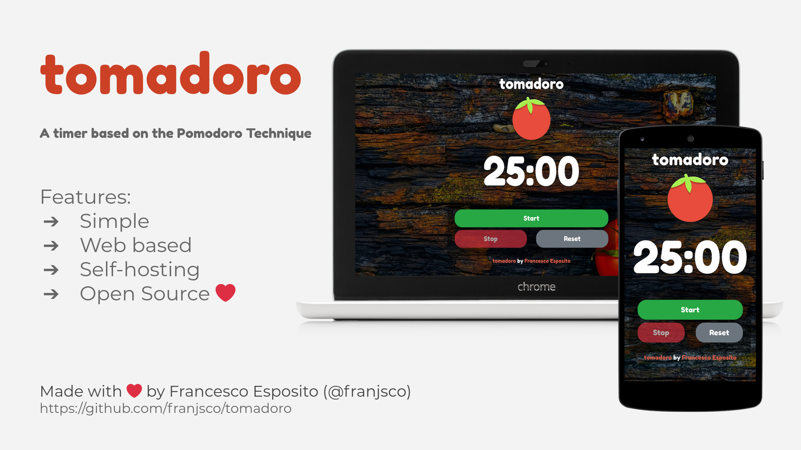

<h1 align="center">Welcome to tomadoro 🍅</h1>
<p>
  
  <a href="https://github.com/franjsco/tomadoro/graphs/commit-activity" target="_blank">
    
  </a>
  <a href="https://github.com/franjsco/tomadoro/blob/master/LICENSE" target="_blank">
    
  </a>
  <a href="https://twitter.com/franjsco" target="_blank">
    
  </a>
</p>

> A timer based on the Pomodoro Technique

### ✨ [Demo](https://franjsco.github.io/tomadoro/)

 

## Install

```sh
npm install
```

## Usage

**Development**
```sh
npm run start
```

**Production**
```sh
npm run build
npm install -g serve
serve -s build
```
Other Solutions: [here](https://create-react-app.dev/docs/deployment/)

## Author

👤 **franjsco (Francesco Esposito)**

* Website: https://franjsco.github.io/
* Twitter: [@franjsco](https://twitter.com/franjsco)
* Github: [@franjsco](https://github.com/franjsco)

## Show your support

Give a ⭐️ if this project helped you!

## 📝 License
Copyright © 2020 [franjsco (Francesco Esposito)](https://github.com/franjsco).<br />
This project is [GPL--3.0--or--later](https://github.com/franjsco/tomadoro/blob/master/LICENSE) licensed.

Photo by Zoltan Tasi on Unsplash

***
_This README was generated with ❤️ by [readme-md-generator](https://github.com/kefranabg/readme-md-generator)_